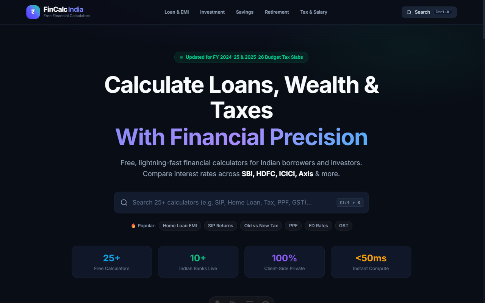
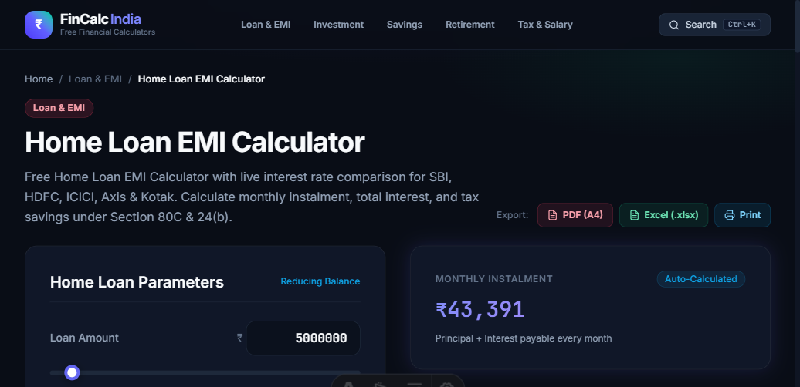
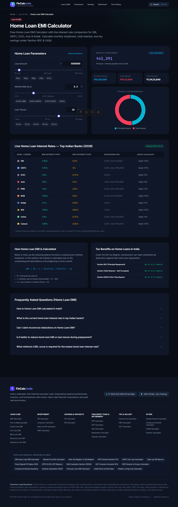
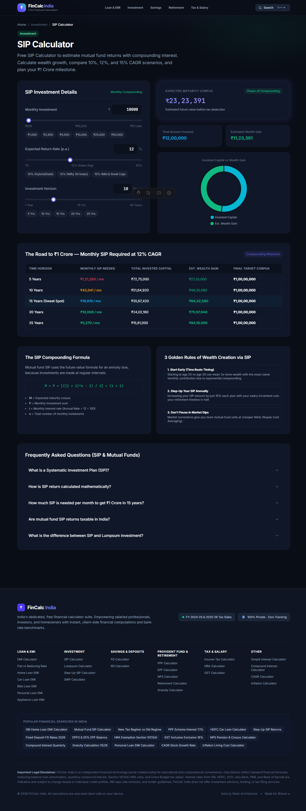
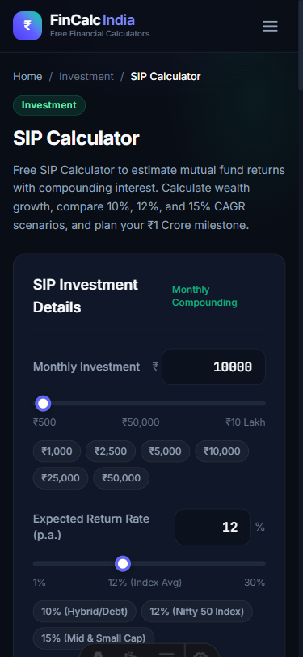

# FinCalc India 🇮🇳 — Comprehensive Financial Calculator Suite

> **Lightning-fast, client-side, privacy-focused financial calculators for Indian borrowers, investors, and taxpayers.**  
> Built with **Astro.js**, **Vanilla CSS + Tailwind CSS v4**, and **Chart.js** — loaded in milliseconds with zero server dependencies.

---

## 🌟 Project Showcase

### 1. Modern Fintech Dashboard & Real-Time Search
Clean, dark obsidian fintech design (`#090d16`) with ambient lighting, instant keyboard-driven search (`Ctrl + K`), and category filtering.



---

### 2. Interactive Calculator & Multi-Format Report Export
Custom slider controls with quick preset chips (`₹25L`, `₹50L`, `₹1Cr`, `10Y`, `20Y`), donut chart breakdown, and one-click report exports:
- **📄 PDF (A4 Portrait)**: Audit-ready printable computation report with bank-statement styling.
- **📊 Excel (.xlsx / .csv)**: Formatted spreadsheet with UTF-8 BOM encoding for seamless Microsoft Excel & Google Sheets compatibility.
- **🖨️ Print View**: Print-optimized `@media print` layout stripping UI controls.



---

### 3. Live Indian Bank Interest Rate Comparisons & FAQ Schema
Benchmark loan and deposit rates across top lenders (**SBI, HDFC, ICICI, Axis, PNB, BoB, Kotak**) with quick "Apply Rate" simulation buttons and Google `FAQPage` rich snippet microdata.



---

### 4. Compounding Milestone Roadmaps & Wealth Creation
Detailed wealth compounding schedules such as the **"Road to ₹1 Crore"** milestone table, mathematical formula cards, and investment strategies.



---

### 5. 100% Mobile Responsive (Zero Horizontal Overflow)
Tested on narrow mobile viewports (360px–414px) with touch-friendly chips, wrapping breadcrumbs, and horizontally scrollable responsive tables.

<div align="center">
  
</div>

---

## 🧮 Calculator Suite (25+ Calculators)

| Category | Calculator | Key Features & Output |
| :--- | :--- | :--- |
| **Loan & EMI** | [Home Loan EMI](/calculators/home-loan-emi-calculator) | Reducing balance EMI, 80C & 24(b) tax cards, bank comparison |
| | [EMI Calculator](/calculators/emi-calculator) | Universal loan EMI, amortization schedule, Yr/Mo tenure toggle |
| | [Car Loan EMI](/calculators/car-loan-emi-calculator) | New & used auto financing, bank interest comparison |
| | [Personal Loan EMI](/calculators/personal-loan-emi-calculator) | Unsecured loan payments, total interest breakdown |
| | [Bike Loan EMI](/calculators/bike-loan-emi-calculator) | Two-wheeler monthly installments, fast preset chips |
| | [Appliance Loan EMI](/calculators/appliance-loan-emi-calculator) | Consumer durables, zero/low-cost EMI models |
| | [Flat vs Reducing Rate](/calculators/flat-vs-reducing-rate) | True effective interest rate comparison |
| **Investment** | [SIP Calculator](/calculators/sip-calculator) | Monthly compounding, ₹1 Crore milestone roadmap |
| | [Step-Up SIP](/calculators/step-up-sip-calculator) | Annual increment modeling to accelerate financial freedom |
| | [Lumpsum Calculator](/calculators/lumpsum-calculator) | One-time mutual fund compounding projector |
| | [SWP Calculator](/calculators/swp-calculator) | Systematic Withdrawal Plan cashflows in retirement |
| **Savings & Deposits** | [FD Calculator](/calculators/fd-calculator) | Quarterly compounding, bank comparison, senior citizen rates |
| | [RD Calculator](/calculators/rd-calculator) | Monthly deposit growth, DICGC insurance insights |
| **Provident Fund & Retirement** | [PPF Calculator](/calculators/ppf-calculator) | 15-year maturity schedule at 7.1% p.a., EEE tax-free status |
| | [EPF Calculator](/calculators/epf-calculator) | Employee/Employer split, 8.25% EPFO interest modeling |
| | [NPS Calculator](/calculators/nps-calculator) | National Pension System annuity & lump sum corpus |
| | [Retirement Calculator](/calculators/retirement-calculator) | Inflation-adjusted target retirement corpus |
| | [Gratuity Calculator](/calculators/gratuity-calculator) | Gratuity Act formula `(15 × Last Drawn × Years) / 26` |
| **Tax & Salary** | [Income Tax Calculator](/calculators/income-tax-calculator) | **Old vs New Tax Regime (FY 2024-25 / 2025-26)** with ₹75k std deduction & 87A rebate |
| | [HRA Exemption](/calculators/hra-calculator) | Section 10(13A) three-condition rule for Metro/Non-metro |
| | [GST Calculator](/calculators/gst-calculator) | Inclusive/Exclusive modes, CGST/SGST/IGST breakdown |
| **General Finance** | [Compound Interest](/calculators/compound-interest-calculator) | Annual, semi-annual, quarterly, and monthly cycles |
| | [Simple Interest](/calculators/simple-interest-calculator) | Classic `(P × R × T) / 100` with visual ratio bar |
| | [CAGR Calculator](/calculators/cagr-calculator) | Compound Annual Growth Rate for stocks & mutual funds |
| | [Inflation Calculator](/calculators/inflation-calculator) | Purchasing power erosion & future expense projections |

---

## ⚡ Technical Highlights

- **Static Site Generation (SSG)**: Built with **Astro 5+**, rendering pure HTML with hydration only where interactive charts/sliders are needed.
- **Client-Side Privacy**: 100% of calculations execute directly in the user's browser. Zero financial data is ever sent to a server.
- **Tailwind CSS v4 Design System**: Pure CSS custom properties with `@theme` tokens, glassmorphism cards, and responsive grids.
- **Universal Export Engine**:
  - **Excel**: Generates clean `.csv` with UTF-8 BOM (`\uFEFF`) and structured column sections.
  - **PDF (A4)**: Configured with `@page { size: A4 portrait; margin: 12mm 14mm; }` for pixel-perfect printing and PDF generation.
- **Search Engine Optimization**:
  - Auto-generated `sitemap-index.xml` via `@astrojs/sitemap`
  - Fully configured `robots.txt`
  - Schema.org microdata: `FAQPage`, `WebApplication`, and `BreadcrumbList` on every page

---

## 🚀 Getting Started

### Prerequisites
- Node.js 18.x or higher
- npm 9.x or higher

### Installation

```bash
# Clone repository
git clone https://github.com/your-username/emi_calculator.git
cd emi_calculator

# Install dependencies
npm install

# Start local development server
npm run dev
```

Visit `http://localhost:4321` in your browser.

### Production Build

```bash
npm run build
npm run preview
```

---

## 🔒 Security, Compliance & Regulatory Framework (2026)

FinCalc India is engineered to meet modern financial privacy and consumer protection standards:

- **DPDP Act 2023 Compliant**: 100% in-browser, client-side execution. Zero user data, salaries, loan amounts, PAN, or Aadhaar are collected or transmitted.
- **Security Hardening**:
  - `X-Content-Type-Options: nosniff` header protection
  - `Referrer-Policy: strict-origin-when-cross-origin`
  - Restrictive `Permissions-Policy: camera=(), microphone=(), geolocation=(), payment=()`
  - Safe outbound linking with `rel="noopener noreferrer" target="_blank"` to protect against tabnabbing
- **Regulatory Framework Guide (`/regulatory-framework`)**:
  - **RBI Directives 2026**: Mandated Key Fact Statement (KFS), ban on penal interest compounding, and zero prepayment penalties on floating-rate individual housing loans.
  - **Union Budget Updates**: FY 2024-25 / 2025-26 New Tax Regime slabs, enhanced ₹75,000 standard deduction under Section 16(ia), and Section 87A rebate.
  - **Capital Gains Taxes**: Revised 12.5% Long-Term Capital Gains (LTCG) and 20% Short-Term Capital Gains (STCG) on equity.
  - **Official Portals Directory**: Direct, authenticated links to RBI, Income Tax Department, SEBI, EPFO, PFRDA, GSTN, and NHB.
- **Legal Transparency**: Dedicated [Terms & Conditions](/terms-and-conditions), [Privacy Policy](/privacy-policy), and [Regulatory Disclaimers](/disclaimer) under Indian jurisdiction (IT Act 2000 & Consumer Protection Act 2019).

---

## 📄 License
This project is licensed under the [MIT License](LICENSE) © 2026 FinCalc India. Free for educational, commercial, and personal financial planning use.

